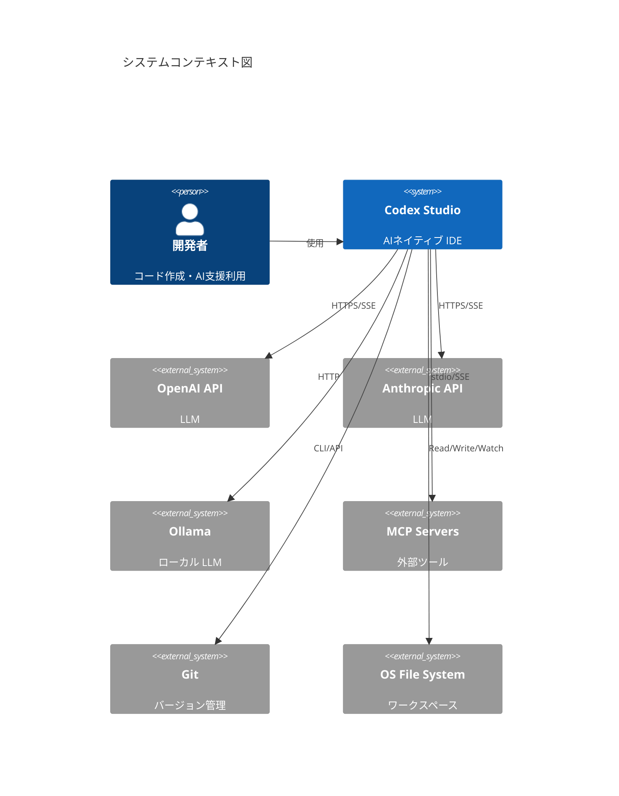
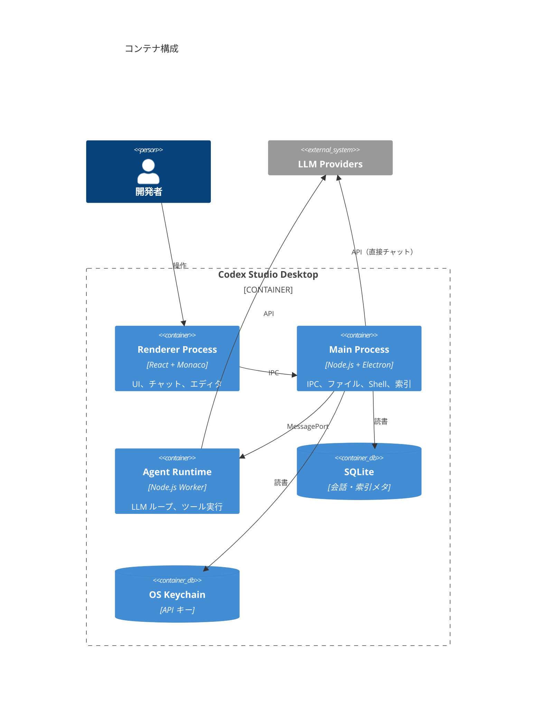

# アーキテクチャ定義書：Codex Studio

| 項目 | 内容 |
|------|------|
| 版 | 1.0 |
| 作成日 | 2026-07-15 |

---

## 1. アーキテクチャ方針

| 原則 | 説明 |
|------|------|
| **Local-first** | コード・索引・履歴はローカル優先。クラウドはオプション |
| **Security by isolation** | 特権操作（Shell, Write）は Main Process / サンドボックスで実行 |
| **Provider agnostic** | LLM プロバイダをアダプタパターンで抽象化 |
| **Event-driven Agent** | Agent ループはイベントソーシング的にステップ記録 |
| **Extensible via MCP** | コアツール + MCP で機能拡張 |

---

## 2. システムコンテキスト



---

## 3. コンテナ diagram



---

## 4. レイヤードアーキテクチャ

```
┌─────────────────────────────────────────────────────────┐
│ Presentation Layer                                      │
│  React Components, Monaco, State (Zustand/Jotai)        │
├─────────────────────────────────────────────────────────┤
│ Application Layer                                       │
│  Use Cases: SendMessage, RunAgent, ApplyDiff, IndexWS  │
├─────────────────────────────────────────────────────────┤
│ Domain Layer                                            │
│  Entities: Session, Message, ToolCall, Workspace        │
│  Services: AgentOrchestrator, ContextBuilder            │
├─────────────────────────────────────────────────────────┤
│ Infrastructure Layer                                    │
│  LLM Adapters, FileSystem, Ripgrep, Shell, SQLite, MCP  │
└─────────────────────────────────────────────────────────┘
```

### 4.1 プロセス責務

| プロセス | 責務 | 技術 |
|----------|------|------|
| **Renderer** | UI 描画、ユーザー入力、ストリーム表示 | React 19, Monaco, Tailwind |
| **Main** | ウィンドウ、メニュー、IPC ルーティング、FS 監視 | Electron Main |
| **Agent Worker** | LLM 通信、ツールディスパッチ、ループ制御 | Node Worker Threads |
| **Indexer Worker** | バックグラウンド索引 | Node Worker Threads |

---

## 5. コアコンポーネント

### 5.1 Agent Orchestrator

Agent 実行の中枢。以下のステートマシンで動作する。

```
Idle → Planning → ToolExecution → Observation → (loop) → Completed
                      ↓                              ↑
                   AwaitingApproval ──────────────────┘
                      ↓
                   Cancelled / Failed
```

**責務**

- LLM へのメッセージ構築（system + rules + context + history）
- ツール呼び出しのパース・検証・ディスパッチ
- 最大イテレーション / タイムアウト管理
- ストリーミングイベントの Renderer への転送

### 5.2 Context Builder

ユーザーの `@file` 指定、自動コンテキスト、Rules を統合し、トークン予算内に収める。

```
Inputs:
  - User message
  - @ attachments (files, folders)
  - Rules (global, workspace)
  - Tool results (previous turns)
  - Codebase snippets (grep / semantic)

Output:
  - ChatCompletionMessage[]
  - tokenCount estimate
```

### 5.3 Tool Registry

| カテゴリ | 実行場所 | サンドボックス |
|----------|----------|----------------|
| Read-only FS | Main | ワークスペース外パス拒否 |
| Write FS | Main | ユーザー承認 + バックアップ |
| Shell | Main (pty) | cwd 制限、denylist |
| MCP | 子プロセス | サーバー単位の権限 |

### 5.4 Index Service

```
FileWatcher → Debounce → IncrementalIndexer → SQLite
                              ↑
InitialScan ──────────────────┘
```

- **InitialScan**: ワークスペースオープン時に全ファイルメタ収集
- **FileWatcher**: chokidar による変更検知
- **Search**: ripgrep CLI または WASM バインディング

### 5.5 LLM Provider Adapter

```typescript
interface LLMProvider {
  id: string;
  chat(params: ChatParams): AsyncIterable<StreamEvent>;
  countTokens(messages: Message[]): number;
  supportsTools: boolean;
  supportsVision: boolean;
}
```

実装: `OpenAIProvider`, `AnthropicProvider`, `OllamaProvider`, `OpenAICompatibleProvider`

---

## 6. 通信・IPC 設計

### 6.1 IPC チャネル（Electron contextBridge 経由）

| チャネル | 方向 | 用途 |
|----------|------|------|
| `workspace:open` | R→M | ワークスペース開く |
| `file:read/write` | R↔M | ファイル操作 |
| `chat:send` | R→M→Worker | チャット送信 |
| `agent:run` | R→M→Worker | Agent 開始 |
| `agent:cancel` | R→M | 中断 |
| `agent:event` | Worker→M→R | ストリームイベント |
| `index:status` | M→R | 索引進捗 |
| `settings:get/set` | R↔M | 設定 |

### 6.2 Agent イベント（ストリーム）

```typescript
type AgentEvent =
  | { type: 'text_delta'; content: string }
  | { type: 'tool_call_start'; tool: string; args: unknown }
  | { type: 'tool_call_result'; tool: string; result: unknown }
  | { type: 'approval_required'; action: PendingAction }
  | { type: 'done'; usage: TokenUsage }
  | { type: 'error'; message: string };
```

---

## 7. データアーキテクチャ

### 7.1 ER 概要

```
Workspace 1──* Session 1──* Message 1──* ToolCall
     │
     └──* IndexEntry (path, hash, mtime)
```

### 7.2 ストレージ配置

```
~/.codex-studio/
├── config.json          # グローバル設定（暗号化フィールド）
├── keychain/            # OS キーチェーン委譲
├── logs/                # 監査ログ
└── workspaces/
    └── {hash}/
        ├── sessions.db  # SQLite
        └── index.db     # SQLite
```

---

## 8. セキュリティアーキテクチャ

### 8.1 脅威モデル

| 脅威 | 対策 |
|------|------|
| 悪意ある LLM 出力（XSS） | Markdown サニタイズ、CSP |
| パストラバーサル | パス正規化 + ワークスペース境界チェック |
| Shell インジェクション | 引数エスケープ、denylist |
| API キー漏洩 | Keychain、ログマスク |
| MCP サーバー悪用 | ユーザー明示インストール、権限分離 |

### 8.2 権限モデル

| モード | Read | Write | Shell | Network |
|--------|------|-------|-------|---------|
| Ask | ✓ | ✗ | ✗ | LLM のみ |
| Agent（デフォルト） | ✓ | 承認後 | 承認後 | LLM + 承認後 |
| Agent（YOLO） | ✓ | ✓ | ✓ | ✓ |

---

## 9. デプロイメント

### 9.1 デスクトップ配布

- **macOS**: `.dmg` + 公証（Notarization）
- **Windows**: `.exe`（NSIS）+ コード署名
- **Linux**: `.AppImage` / `.deb`

### 9.2 自動更新

- `electron-updater` + GitHub Releases / 自社 CDN
- 差分更新（Phase 2）

### 9.3 Phase 2: クラウド Agent

```
Desktop ──► API Gateway ──► Agent VM Pool
                │
                └──► Object Storage（ワークスペーススナップショット）
```

---

## 10. 技術スタック

| 領域 | 選定 | 理由 |
|------|------|------|
| デスクトップ | Electron 33+ | 実績、Node 統合 |
| UI | React 19 + TypeScript | エコシステム |
| エディタ | Monaco Editor | VS Code 互換 |
| 状態管理 | Zustand | 軽量 |
| DB | better-sqlite3 | 同期 API、性能 |
| ビルド | Vite + electron-vite | 高速 HMR |
| テスト | Vitest + Playwright | ユニット + E2E |
| パッケージ | pnpm monorepo | ワークスペース分割 |

### 10.1 Monorepo 構成

```
packages/
├── app/              # Electron メインエントリ
├── renderer/         # React UI
├── agent-core/       # Agent ロジック（プロセス非依存）
├── llm-adapters/     # プロバイダアダプタ
├── tools/            # 組込ツール実装
├── indexer/          # 索引サービス
├── shared/           # 型・ユーティリティ
└── mcp-client/       # MCP 連携（Phase 2）
```

---

## 11. 可用性・スケーラビリティ

| 観点 | 方針 |
|------|------|
| オフライン | ローカルモデル（Ollama）、履歴閲覧 |
| 大規模リポジトリ | 索引の lazy loading、検索結果上限 |
| 長時間 Agent | チェックポイント保存、再開 |
| 将来のクラウド化 | Agent Worker を Kubernetes Job 化可能な設計 |

---

## 12. ADR（Architecture Decision Records）概要

| ADR | 決定 | 理由 |
|-----|------|------|
| ADR-001 | Electron 採用 | Web 技術 + Node FS/Shell アクセス |
| ADR-002 | Agent を Worker Thread 分離 | UI ブロック防止 |
| ADR-003 | SQLite | ローカル永続化の標準 |
| ADR-004 | ripgrep 外部プロセス | 性能、実績 |
| ADR-005 | MCP は Phase 2 | MVP スコープ抑制 |
| ADR-006 | OpenAI 互換 API を共通 IF | プロバイダ多様性 |
