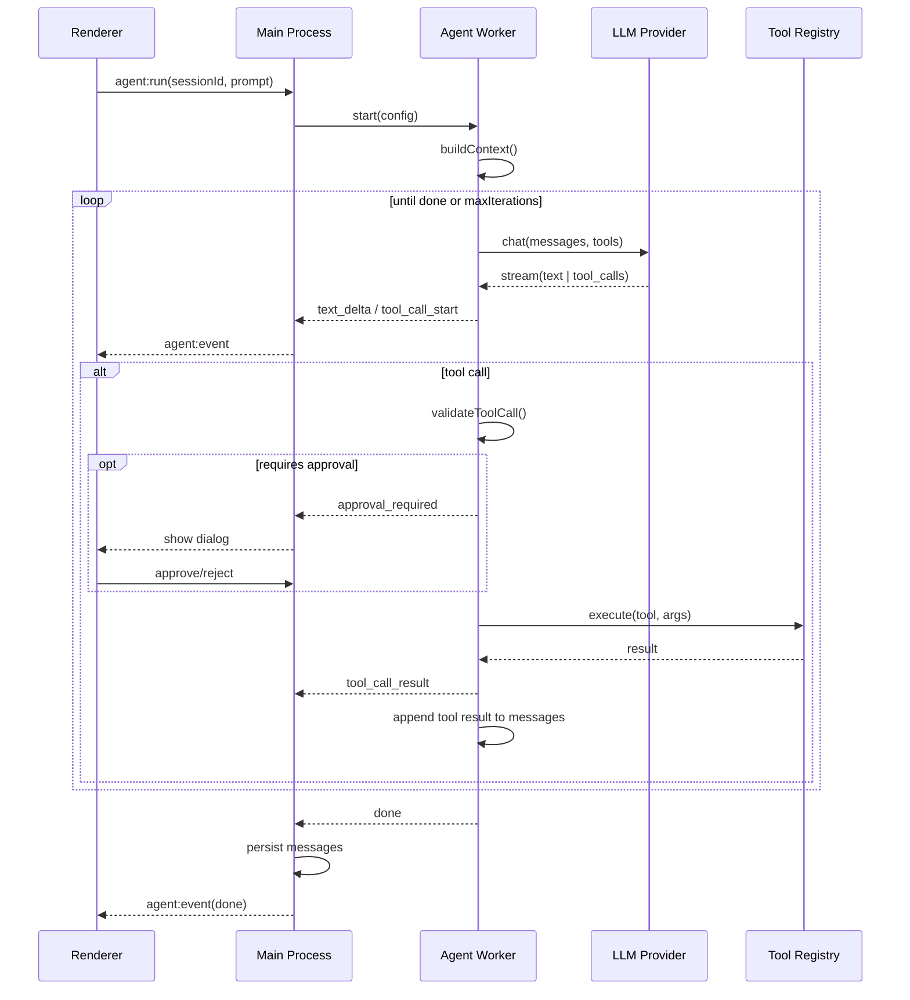

# 設計書：Codex Studio

| 項目 | 内容 |
|------|------|
| 版 | 1.0 |
| 作成日 | 2026-07-15 |
| 関連文書 | 仕様書、アーキテクチャ定義書 |

---

## 1. ドメインモデル

### 1.1 エンティティ

```typescript
/** ワークスペース */
interface Workspace {
  id: string;
  rootPaths: string[];
  name: string;
  openedAt: Date;
  settings: WorkspaceSettings;
}

/** 会話セッション */
interface Session {
  id: string;
  workspaceId: string;
  title: string;
  mode: 'ask' | 'agent' | 'plan';
  modelId: string;
  createdAt: Date;
  updatedAt: Date;
}

/** メッセージ */
interface Message {
  id: string;
  sessionId: string;
  role: 'user' | 'assistant' | 'system' | 'tool';
  content: string;
  attachments?: Attachment[];
  toolCalls?: ToolCall[];
  tokenUsage?: TokenUsage;
  createdAt: Date;
}

/** ツール呼び出し */
interface ToolCall {
  id: string;
  messageId: string;
  name: string;
  arguments: Record<string, unknown>;
  result?: unknown;
  status: 'pending' | 'running' | 'completed' | 'failed' | 'cancelled';
  startedAt?: Date;
  completedAt?: Date;
}

/** 添付コンテキスト */
interface Attachment {
  type: 'file' | 'folder' | 'codebase' | 'selection' | 'image';
  path?: string;
  content?: string;
  range?: { startLine: number; endLine: number };
}
```

### 1.2 値オブジェクト

```typescript
interface TokenUsage {
  promptTokens: number;
  completionTokens: number;
  totalTokens: number;
}

interface PendingAction {
  type: 'write' | 'delete' | 'shell';
  description: string;
  payload: unknown;
  diff?: string;
}

interface IndexEntry {
  path: string;
  relativePath: string;
  size: number;
  mtime: number;
  contentHash?: string;
}
```

---

## 2. Agent ループ詳細設計

### 2.1 シーケンス



### 2.2 Agent 設定

```typescript
interface AgentConfig {
  sessionId: string;
  modelId: string;
  maxIterations: number;        // default: 25
  maxTokensPerTurn: number;     // default: 8192
  contextTokenBudget: number;   // default: 100000
  requireApproval: {
    write: boolean;             // default: true
    delete: boolean;            // default: true
    shell: boolean;             // default: true
  };
  enabledTools: string[];
  rules: string[];
}
```

### 2.3 ツールスキーマ（OpenAI Function Calling 形式）

```json
{
  "name": "Read",
  "description": "Read file contents with optional line range",
  "parameters": {
    "type": "object",
    "properties": {
      "path": { "type": "string", "description": "Absolute or workspace-relative path" },
      "offset": { "type": "integer", "description": "Start line (1-indexed)" },
      "limit": { "type": "integer", "description": "Max lines to read" }
    },
    "required": ["path"]
  }
}
```

---

## 3. ツール実装設計

### 3.1 Tool インターフェース

```typescript
interface Tool {
  name: string;
  description: string;
  parameters: JSONSchema;
  requiresApproval: boolean;
  execute(ctx: ToolContext, args: unknown): Promise<ToolResult>;
}

interface ToolContext {
  workspaceRoot: string;
  sessionId: string;
  signal: AbortSignal;
}

interface ToolResult {
  success: boolean;
  output: string;
  metadata?: Record<string, unknown>;
}
```

### 3.2 各ツール仕様

#### Read

- ワークスペース外パスは拒否（`resolveWithinWorkspace()`）
- バイナリファイルは拒否（拡張子 + MIME 判定）
- デフォルト上限: 2000 行 / 100KB

#### Write

- 新規作成 / 上書き
- 実行前に diff 生成（unified diff 形式）
- バックアップ: `~/.codex-studio/backups/{sessionId}/{timestamp}/`

#### StrReplace

- `old_string` の一意性チェック（複数マッチ時はエラー返却）
- `replace_all` オプション

#### Shell

```typescript
interface ShellArgs {
  command: string;
  cwd?: string;
  timeout?: number;  // default: 30000ms
}
```

- denylist: `rm -rf /`, `mkfs`, `curl | sh`, 等（設定ファイルで拡張）
- stdout/stderr を結合して返却（上限 100KB）
- 終了コードを metadata に含める

#### Grep / Glob

- ripgrep / glob ライブラリ使用
- 結果件数上限: 1000（超過時は truncation 通知）

---

## 4. Context Builder 設計

### 4.1 構築順序

1. **System prompt**（固定 + Rules）
2. **Workspace summary**（ルートパス、主要ファイル一覧）
3. **User rules**（`.codex/rules/*.md`）
4. **Conversation history**（古い順、予算超過時は要約 or 切り捨て）
5. **Current turn attachments**
6. **Tool results**（直近 N ターン優先）

### 4.2 トークン予算管理

```typescript
function trimToBudget(messages: Message[], budget: number): Message[] {
  // 1. system + rules は常に保持
  // 2. 最新 user message は常に保持
  // 3. 中間履歴を古い順に削除
  // 4. 大きい tool result は truncate
}
```

### 4.3 @codebase 自動検索

1. ユーザープロンプトをクエリとして ripgrep + 簡易キーワード抽出
2. ヒットファイルの関連行 ±10 行を抽出
3. Phase 2: Embedding 類似度ランキング

---

## 5. UI コンポーネント設計

### 5.1 コンポーネントツリー

```
App
├── Layout
│   ├── ActivityBar
│   ├── Sidebar
│   │   ├── Explorer
│   │   ├── SearchPanel
│   │   └── SessionList
│   ├── EditorArea
│   │   ├── TabBar
│   │   ├── MonacoEditor
│   │   └── DiffEditor
│   └── AIPanel
│       ├── ChatHeader (model selector, mode toggle)
│       ├── MessageList
│       │   ├── UserMessage
│       │   ├── AssistantMessage
│       │   └── ToolCallCard
│       ├── ToolLog
│       └── ChatInput (@ autocomplete)
├── CommandPalette
├── ApprovalDialog
└── StatusBar
```

### 5.2 主要コンポーネント Props

```typescript
interface ChatInputProps {
  onSend: (text: string, attachments: Attachment[]) => void;
  onCancel: () => void;
  isStreaming: boolean;
  placeholder?: string;
}

interface ToolCallCardProps {
  toolCall: ToolCall;
  onExpand: () => void;
  onApprove?: () => void;
  onReject?: () => void;
}

interface DiffEditorProps {
  original: string;
  modified: string;
  filePath: string;
  onApply: (selection?: Range) => void;
  onReject: () => void;
}
```

### 5.3 状態管理（Zustand）

```typescript
interface AppStore {
  // Workspace
  workspace: Workspace | null;
  openWorkspace: (path: string) => Promise<void>;

  // Sessions
  sessions: Session[];
  activeSessionId: string | null;
  createSession: () => Session;
  
  // Chat
  messages: Record<string, Message[]>;
  streamingState: 'idle' | 'streaming' | 'awaiting_approval';
  
  // Agent
  pendingApproval: PendingAction | null;
  approveAction: () => void;
  rejectAction: () => void;
}
```

---

## 6. IPC API 設計

### 6.1 型安全 IPC（shared パッケージ）

```typescript
// packages/shared/src/ipc.ts
export interface IpcApi {
  workspace: {
    open: (path: string) => Promise<Workspace>;
    close: () => Promise<void>;
    getFileTree: () => Promise<FileNode[]>;
  };
  file: {
    read: (path: string) => Promise<string>;
    write: (path: string, content: string) => Promise<void>;
    watch: (callback: (event: FileWatchEvent) => void) => () => void;
  };
  chat: {
    send: (sessionId: string, message: string, attachments?: Attachment[]) => AsyncIterable<AgentEvent>;
    cancel: (sessionId: string) => Promise<void>;
  };
  session: {
    list: () => Promise<Session[]>;
    getMessages: (sessionId: string) => Promise<Message[]>;
    delete: (sessionId: string) => Promise<void>;
  };
  settings: {
    get: () => Promise<AppSettings>;
    set: (partial: Partial<AppSettings>) => Promise<void>;
  };
  index: {
    getStatus: () => Promise<IndexStatus>;
    search: (query: string) => Promise<SearchResult[]>;
  };
}
```

### 6.2 Preload スクリプト

```typescript
// contextBridge で Renderer に公開
contextBridge.exposeInMainWorld('codex', {
  invoke: (channel: string, ...args: unknown[]) => ipcRenderer.invoke(channel, ...args),
  on: (channel: string, listener: (...args: unknown[]) => void) => { /* ... */ },
});
```

---

## 7. データベース設計

### 7.1 sessions.db スキーマ

```sql
CREATE TABLE sessions (
  id TEXT PRIMARY KEY,
  workspace_id TEXT NOT NULL,
  title TEXT NOT NULL,
  mode TEXT NOT NULL DEFAULT 'ask',
  model_id TEXT NOT NULL,
  created_at INTEGER NOT NULL,
  updated_at INTEGER NOT NULL
);

CREATE TABLE messages (
  id TEXT PRIMARY KEY,
  session_id TEXT NOT NULL REFERENCES sessions(id) ON DELETE CASCADE,
  role TEXT NOT NULL,
  content TEXT NOT NULL,
  attachments_json TEXT,
  token_usage_json TEXT,
  created_at INTEGER NOT NULL
);

CREATE TABLE tool_calls (
  id TEXT PRIMARY KEY,
  message_id TEXT NOT NULL REFERENCES messages(id) ON DELETE CASCADE,
  name TEXT NOT NULL,
  arguments_json TEXT NOT NULL,
  result_json TEXT,
  status TEXT NOT NULL,
  started_at INTEGER,
  completed_at INTEGER
);

CREATE INDEX idx_messages_session ON messages(session_id, created_at);
CREATE INDEX idx_sessions_workspace ON sessions(workspace_id, updated_at DESC);
```

### 7.2 index.db スキーマ

```sql
CREATE TABLE files (
  path TEXT PRIMARY KEY,
  relative_path TEXT NOT NULL,
  size INTEGER NOT NULL,
  mtime INTEGER NOT NULL,
  content_hash TEXT,
  indexed_at INTEGER NOT NULL
);

CREATE INDEX idx_files_relative ON files(relative_path);
CREATE VIRTUAL TABLE files_fts USING fts5(relative_path, content);
```

---

## 8. LLM Adapter 設計

### 8.1 統一メッセージ形式

```typescript
type UnifiedMessage =
  | { role: 'system' | 'user' | 'assistant'; content: string | ContentPart[] }
  | { role: 'tool'; toolCallId: string; content: string };

type ContentPart =
  | { type: 'text'; text: string }
  | { type: 'image'; base64: string; mimeType: string };
```

### 8.2 ストリームイベント

```typescript
type StreamEvent =
  | { type: 'text'; delta: string }
  | { type: 'tool_call'; id: string; name: string; arguments: string }
  | { type: 'done'; usage: TokenUsage }
  | { type: 'error'; error: Error };
```

### 8.3 プロバイダ別変換

| 項目 | OpenAI | Anthropic |
|------|--------|-----------|
| ツール形式 | tools + tool_calls | tools + tool_use blocks |
| システム | system role | system parameter |
| ストリーム | SSE chunks | SSE events |

`AnthropicAdapter` は内部で Unified → Anthropic 形式に変換し、逆変換して返す。

---

## 9. Rules / Skills 設計

### 9.1 Rules 読込優先順位

1. グローバル: `~/.codex-studio/rules/`
2. ワークスペース: `{workspace}/.codex/rules/`
3. ユーザー UI 設定

```markdown
<!-- .codex/rules/typescript.md -->
---
globs: ["**/*.ts", "**/*.tsx"]
alwaysApply: false
---

- Use strict TypeScript
- Prefer functional components
```

### 9.2 Skills

```markdown
<!-- ~/.cursor/skills-cursor/example/SKILL.md -->
---
name: example
description: When to use this skill
---

# Instructions
...
```

Skills は Agent 開始時に description ベースで関連 Skill を LLM に提示（Phase 2 で自動選択）。

---

## 10. エラーハンドリング

| エラー種別 | ユーザー表示 | リトライ |
|------------|--------------|----------|
| LLM Rate Limit | 「レート制限。しばらく待って再試行」 | 指数バックオフ |
| LLM Auth Error | 「API キーを確認してください」 | なし |
| Tool Timeout | ツールカードに timeout 表示 | 手動 |
| Tool Permission Denied | 承認ダイアログ | なし |
| Index Corruption | バックグラウンド再索引 | 自動 |
| Disk Full | トースト + 設定リンク | なし |

---

## 11. テスト設計

### 11.1 テストピラミッド

| 層 | 対象 | ツール |
|----|------|--------|
| Unit | Agent loop, Context builder, Tools | Vitest |
| Integration | IPC, SQLite, LLM mock | Vitest |
| E2E | 起動→チャット→Agent 完遂 | Playwright |

### 11.2 主要テストケース

```typescript
describe('AgentOrchestrator', () => {
  it('should complete simple read-only task in one iteration');
  it('should request approval before write');
  it('should respect maxIterations');
  it('should handle cancellation mid-tool');
  it('should recover from LLM stream error');
});

describe('ReadTool', () => {
  it('should reject path outside workspace');
  it('should respect line limit');
});
```

---

## 12. 設定スキーマ

```typescript
interface AppSettings {
  general: {
    theme: 'dark' | 'light' | 'system';
    language: 'ja' | 'en';
  };
  models: {
    defaultChatModel: string;
    defaultAgentModel: string;
    providers: ProviderConfig[];
  };
  agent: {
    maxIterations: number;
    requireApproval: AgentConfig['requireApproval'];
    yoloMode: boolean;
  };
  privacy: {
    telemetryEnabled: boolean;
    blockSecretPatterns: string[];
  };
  indexer: {
    excludePatterns: string[];
    maxFileSize: number;
  };
}
```

---

## 13. ログ・監視

```typescript
interface AuditLogEntry {
  timestamp: string;
  sessionId: string;
  event: 'tool_execute' | 'file_write' | 'shell_run' | 'llm_request';
  details: Record<string, unknown>;
  // シークレットフィールドは [REDACTED]
}
```

- ログ出力: `~/.codex-studio/logs/audit-{date}.jsonl`
- 開発時: structured JSON to stdout
